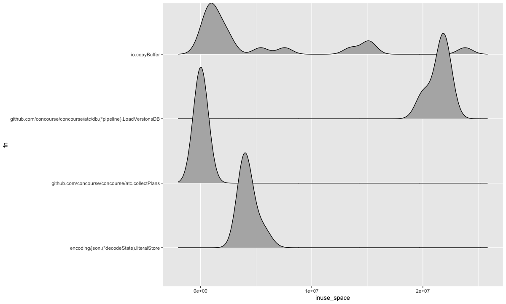

heapvis - visualizing heap profile diffs over time

### the hypothesis

while being able to visualize a given profile taken at a certain point
in time is great, the great insights will come from looking at how that
changes over time, as time passes.

`heapvis` aims at making that simple to do.

for instance, given 18 heap profiles, we can tell how the distribution of
`inuse_space` for certain functions look like:

